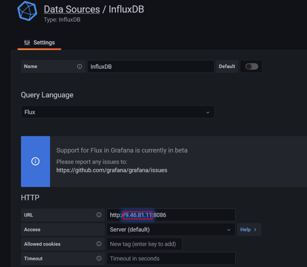

# Use Knative to scale containers with SCC and InstantOn


## Test environment:

### OCP 4.14 

Reserved from TechZone


### VM - RHEL 9.2

Instructions:

Knative setup - https://github.com/rhagarty/techxchange-knative-setup

SCC Lab notes - https://github.com/mpirvu/TechXchange2023/tree/main

All Liberty apps use the following base image:

```FROM icr.io/appcafe/open-liberty:full-java17-openj9-ubi```

JITServers use the following base image and settings:

```FROM icr.io/appcafe/ibm-semeru-runtimes:open-17-jre-ubi```

```bash
resources:
  requests:
    memory: "2048Mi"
    cpu: "1000m"
  limits:
    memory: "2048Mi"
    cpu: "8000m"
```

5 Knative serving services:

acmeair-baseline

Baseline Liberty app

acmeair-baseline-sm

Baseline Liberty app with half the memory size (SM)

acmeair-scc

Baseline Liberty (SM) app with connection to its own dedicated JITServer (jitserver)

acmeair-instanton

Baseline Liberty (SM) app with InstantOn image

acmeair-sccio

Baseline Liberty (SM) app with InstantOn image and connection to its own dedicated JITServer (jitserver2)


# Instructions


The application used as a benchmark is AcmeAirEE8, a Java EE8 application that implements an airline reservation system and runs on top of OpenLiberty.
There are two deployments of this application: one that can offload JIT compilations to a Semeru Cloud Compiler service (the one depicted at the bottom)
and one that does not benefit from Semeru Cloud Compiler (the one depicted at the top).
We will refer to these two deployments as "AcmeAir Baseline" and "AcmeAir with Semeru Cloud Compiler" respectively.
Both deployments use the same database (mongodb).
Load is applied to both deployments using two identical JMeter containers.
Throughput values are sent by the JMeter instances to an influxdb database and from there to a grafana container to be displayed in a dashboard.
The two AcmeAir deployments together with the Semeru Cloud Compiler service and mongodb service are deployed in OpenShift and use Knative to scale up and down based on the load.
The rest of the pods (for JMeter, influxdb and grafana) run outside of OpenShift on a separate machine.

As part of this lab, the Knative service needs to installed and configured. This will typically be performed by the instructor before the lab and be available for all to use. If you are the instructor, or if you would like to see the steps involved, please refer to the [Knative setup instruction](https://github.com/rhagarty/techxchange-knative-setup).

Login as root using the password provided in the Lab Guide:
```
su --login root
```

Clone the repository
```
cd /home/techzone/Lab-SCC
```
```
git clone https://github.com/mpirvu/TechXchange2023.git
```
```
cd TechXchange2023
```

> **NOTE**: If you prefer to use an IDE to view the project, you can run VSCode with admin privileges using the following command: 
> ```bash
> sudo code --no-sandbox --user-data-dir /home/techzone
> ```


Then follow the instructions below.

1. Find the IP of the current machine with `ifconfig`. It should be something like `10.xxx.xxx.xxx` or `192.xxx.xxx.x`.
   Then use the `./searchReplaceIPAddress.sh` script to change all "9.46.81.11" addresses from bash scripts to the IP of the current machine.
   Use the following command to do this (after replacing xxx.xxx.xxx.xxx with the IP of the current machine)
   ```
   ./searchReplaceIPAddress.sh 9.46.81.11 xxx.xxx.xxx.xxx
   ```

2. Start the influxdb container in normal operation mode:
   ```
   ./startInflux.sh
   ```
   Verify the influxdb container is up and running:
   ```
   podman ps -a | grep influxdb
   ```

   Create another data bucket:
   ```
   podman exec influxdb influx bucket create -n jmeter2 -o IBM -r 1d
   ```

   Verify that two buckets called jmeter and jmeter2 exist:
   ```
   podman exec influxdb influx bucket list
   ```

3. Create the JMeter container:
   ```
   cd BuildImages/JMeterContext
   ```
   ```
   ./build_jmeter.sh
   ```
   ```
   cd ../..
   ```

4. Create the mongodb container
   ```
   cd BuildImages/MongoContext
   ```
   ```
   ./build_mongo.sh
   ```
   ```
   cd ../..
   ```

5. Create the two AcmeAir containers (with and without InstantON).
   ```
   cd BuildImages/LibertyContext
   ```
   ```
   ./build_acmeair.sh
   ```
   ```
   ./checkpoint.sh
   ```
   ```
   cd ../..
   ```

6. Push the images for AcmeAir and mongodb to the OCP private repository

   **IMPORTANT**: Login to the OCP console, using the desktop URL provided in the TechZone OCP server reservation.

   From the OCP console UI, click the username in the top right corner, and select `Copy login command`.

   

   Press `Display Token` and copy the `Log in with this token` command.

   

   Paste the command into your terminal window. You should receive a confirmation message that you are logged in.

   Once logged in, create and switch to the `scclab-[Your_initial]` namespace:

   > **NOTE**: If you are working on a cluster that is shared with others, please ensure that you are using a unique project name. We recommend using the format scclab- followed by your initials. For example, scclab-rm.
   
   ```
   export CURRENT_NS=scclab-[Your_initial]
   ```
   
   ```
   oc new-project $CURRENT_NS

   oc project $CURRENT_NS
   ```

   After that, log in to the OCP registry:
   ```
   oc registry login --insecure=true
   ```

   Enable the default registry route in OCP to push images to its internal repos

   ```
   oc patch configs.imageregistry.operator.openshift.io/cluster --patch '{"spec":{"defaultRoute":true}}' --type=merge
   ```

   Log Podman into the OCP registry server

   First we need to get the `TOKEN` that we can use to get the password for the registry.

   ```
   oc get secrets -n openshift-image-registry | grep cluster-image-registry-operator-token
   ```

   Take note of the `TOKEN` value, as you need to substitute it in the following command that sets the registry password.

   ```
   export OCP_REGISTRY_PASSWORD=$(oc get secret -n openshift-image-registry cluster-image-registry-operator-token-<INPUT_TOKEN> -o=jsonpath='{.data.token}{"\n"}' | base64 -d)
   ```

   Now set the OCP registry host value.

   ```
   export OCP_REGISTRY_HOST=$(oc get route default-route -n openshift-image-registry --template='{{ .spec.host }}')
   ```

   Finally, we have the values needed for podman to login into the OpenShift registry server.

   ```
   podman login -p $OCP_REGISTRY_PASSWORD -u kubeadmin $OCP_REGISTRY_HOST --tls-verify=false
   ```

   Now tag and push the images for AcmeAir and mongodb to the OCP private repository.

   - mongo-acmeair image

   > ```bash
   > podman tag localhost/mongo-acmeair:5.0.17 $(oc registry info)/$(oc project -q)/mongo-acmeair:5.0.17
   > 
   > podman push $(oc registry info)/$(oc project -q)/mongo-acmeair:5.0.17 --tls-verify=false
   > ```

   - liberty-acmeair-ee8 image

   > ```bash
   > podman tag localhost/liberty-acmeair-ee8:23.0.0.6 $(oc registry info)/$(oc project -q)/liberty-acmeair-ee8:23.0.0.6
   > 
   > podman push $(oc registry info)/$(oc project -q)/liberty-acmeair-ee8:23.0.0.6 --tls-verify=false
   > ```

   - liberty-acmeair-ee8 instantOn image

   > ```bash
   > podman tag localhost/liberty-acmeair-ee8:23.0.0.6-instanton $(oc registry info)/$(oc project -q)/liberty-acmeair-ee8:23.0.0.6-instanton
   > 
   > podman push $(oc registry info)/$(oc project -q)/liberty-acmeair-ee8:23.0.0.6-instanton --tls-verify=false
   > ```

   - Verify the images have been pushed to the OpenShift image repository

   > ```bash
   > oc get imagestream
   > ```

7. Start the grafana container:
   ```
   ./startGrafana.sh
   ```

8. Using the grafana UI in a local browser (http://localhost:3000), configure grafana to get data from influxdb.

   Note: Initial credentials are admin/admin. You can skip the password change.

   Note: There are two pre-configured datasources called InfluxDB and InfluxDB2. However, the IP address of these datasources needs to be adjusted.

   To configure the datasources, select the gear (Configuration) from the left side menu, then select "Data sources", then select the data source you want to configure (InfluxDB or InfluxDB2).
   For the "URL" field of the data source, change the existing IP (9.46.81.11) to the IP machine that runs InfluxDB (this was determined in Step 1 using `ifconfig`).

   

   Then press "Save & Test" (at the bottom of the screen)to validate the connection.
   Make sure you change both data sources.


9. Display the pre-loaded dashboard in grafana UI

   From the left side menu select the "Dashboard" icon (4 squares), then select "Browse", then select "JMeter Load Test".
   Activate the automatic refresh feature for the graphs by navigating to the top-right menu of the Grafana dashboard and selecting the `10 sec` option, as illustrated in the image below.

   

10. Deploy the services in OCP
    1. Update the requisite YAML files with the project namespace you set earlier (CURRENT_NS)
       
       ```
       ./searchReplaceNs.sh
       ```

    2. Go to the Knative directory:
       ```
       cd Knative
       ```

    3. Validate that yaml files have the correct images specified:
       ```
       grep "image:" *.yaml
       ```
       The image should start with `image-registry.openshift-image-registry.svc:5000/` followed by the name of the project where the images were pushed (`scclab-[Your_initial]`) and followed by the image name and tag.

    4. Configure mongodb storage by defining a PersistentVolumeClaim with a specific storageClassName
      
       Run the following command to query default storageclass 
       ```
       oc get storageclass
       ```

       Select the default storageClassName, such as `ocs-storagecluster-xxxxxx (default)`. Use the storageClassName value (ocs-storagecluster-xxxxxx) replace `[Input default storageclass]` in the Mongo.yaml file.

    5. Deploy mongodb:

       ```
       kubectl apply -f Mongo.yaml
       ```
       and validate that the pod is running with:
       ```
       kubectl get pods | grep mongodb
       ```

    6. Restore the mongo database:
       ```
       ./mongoRestore.sh
       ```

    7. Deploy Semeru Cloud Compiler:
       ```
       kubectl apply -f JITServer.yaml
       ```
       and verify it started sucessfully with:
       ```
       kubectl get pods | grep jitserver
       ```

    8. Deploy the default AcmeAir instance:
      
       ```
       kubectl apply -f AcmeAirKN_default.yaml
       ```
       A message should appear in the console saying that the service was created.

    9. Deploy the AcmeAir instance with Semeru Cloud Compiler:

       ```
       kubectl apply -f AcmeAirKN_SCC.yaml
       ```
       Note: if you want to deploy the AcmeAir instance with Semeru Cloud Compiler and InstantON instead, then follow these steps:

       1. ### Verify the Knative containerspec-addcapabilities feature is enabled

            To confirm whether the `containerspec-addcapabilities` is enabled, you can inspect the current configuration of `config-features` by executing the command 
            > ```bash 
            > kubectl -n knative-serving get cm config-features -oyaml | grep -c "kubernetes.containerspec-addcapabilities: enabled" && echo "true" || echo "false"
            > ```

            > **IMPORTANT**: If the command returns true, it indicates that the Knative 'containerspec-addcapabilities' feature is already enabled. Please skip the step regarding editing Knative permissions. However, if it returns false, please contact your instructor regarding this. 
            In a production scenario, you may be required to enable `containerspec-addcapabilities` manually, please refer to our [knative setup instruction](https://github.com/rhagarty/techxchange-knative-setup) for further info.  

       2. Create a Service Account bound to your project namespace:
          ```
          oc create serviceaccount instanton-sa-$CURRENT_NS
          ```

       3. Create a Security Context Constraint named `cap-cr-scc`:
          ```
          oc apply -f scc-cap-cr.yaml
          ```

       4. Add the `instanton-sa` Service Account to the `cap-cr-scc` Security Context Constraint:
          ```
          oc adm policy add-scc-to-user cap-cr-scc -z instanton-sa-$CURRENT_NS
          ```

       5. Deploy the AcmeAir instance with Semeru Cloud Compiler and InstantON:
            
          **IMPORTANT**: Please ensure to fill in all `[Your_initial]` fields with the namespace used in the creation step above before proceeding to apply the YAML file.

          ```
          kubectl apply -f AcmeAirKN_SCC_InstantON.yaml
          ```

    10. Verify that 4 pods are running:

        ```
        kubectl get pods
        ```
        Note: Knative will terminate the AcmeAir pods automatically after about two minutes of inactivity. This does not affect the experiment.

11. Apply external load
    1. Find the external address of the two AcmeAir services. Use
       ```
       kubectl get all | grep http
       ```

       Run the `replaceServerAddress.sh` script to automatically identify and replace the `[OCP server name]` in the `runJMeter.sh` script:
       ```
       ./replaceServerAddress.sh
       ```
       > Alternatively, you can manually extract the part following `http://` or `https://` from the output of the command `kubectl get all | grep http`, and then use it as the address for the service in the `JHOST` variable.
       It should be something like `acmeair-baseline-default.apps.[OCP server name].cloud.techzone.ibm.com` and `acmeair-scc-default.apps.[OCP server name].cloud.techzone.ibm.com` (or `acmeair-sccio-default.apps.[OCP server name].cloud.techzone.ibm.com` for the service with InstantON), and replace the example service address in the `runJMeter.sh`.

       The same information can be obtained with `kn` if installed:
       ```
       kn service list
       ```

    2. Verify that the `runJMeter.sh` script contains these service addresses for the JHOST environment variable passed to the JMeter containers:

       **IMPORTANT**: Please ensure to fill in all fields marked as `[Your_initial]` with the namespace used in the creation steps above, and fill in all fields marked as `[OCP server name]` with the OCP server address you created with TechZone (see the example in the comments mentioned in the "Find the external address of the two AcmeAir services" step) before proceeding to run the runJMeter.sh file.

       ```
       cat runJMeter.sh | grep JHOST
       ```
       **Note**: if you selected to start the `AcmeAirKN_SCC_InstantON` service instead of `AcmeAirKN_SCC`, then edit `runJMeter.sh` to comment out the second container invocation (the one with JHOST="acmeair-scc-scclab-[Your_initial].apps.[OCP server name].cloud.techzone.ibm.com") and remove the comment from the third container invocation (the one with JHOST="acmeair-sccio-scclab-[Your_initial].apps.[OCP server name].cloud.techzone.ibm.com").

    3. Launch jmeter containers:
       ```
       ./runJMeter.sh
       ```
       This will launch two JMeter containers that will generate load for the two AcmeAir services.

       After 10 seconds or so, validate that there are no errors with
       ```
       podman logs jmeter1
       ```
       ```
       podman logs jmeter2
       ```

    4. Go to the grafana dashboard you configured before and watch the throughput results for the two services.

       The AcmeAirEE8 service with Semeru Cloud Compiler should reach peak throughput much faster than the baseline service.


12. Cleanup
    1. Delete the services you created:
       ```
       kubectl delete -f AcmeAirKN_default.yaml
       kubectl delete -f AcmeAirKN_SCC.yaml
       kubectl delete -f AcmeAirKN_SCC_InstantON.yaml
       kubectl delete -f JITServer.yaml
       kubectl delete -f Mongo.yaml
       ```
    2. Stop the grafana and influxdb containers:
       ```
       podman stop grafana
       podman stop influxdb
       ```
